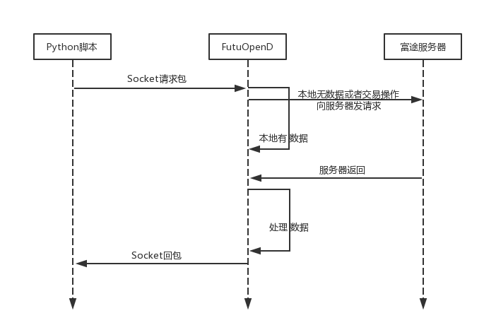

  
.. _FutuOpenD: FutuOpenDGuide.html
  
介绍
========
futu-api提供了交易和行情接口，可以满足个人开发者和机构客户使用富途牛牛软件进行程序化投资的需求。
  
-----------------------------------------------------------------------------------

主要功能
----------

交易品种:
::

          1.港股：正股、ETF、窝轮、牛熊证
          2.美股：正股、ETF、期权
行情数据:
::
          1.支持A股、港股
          2.支持定阅并接收实时报价、逐笔、买卖档，买卖经纪（仅港股)等深度数据

特点
-----
======================    =================================================================================
高效的执行                   配合 FutuOpenD_ ，一行简单的命令就可以执行您的策略
活跃的社区                   富途牛牛圈、QQ群和众多牛人一起分享心得
丰富的接口                   港股、A股行情数据获取、港美股实盘交易、A股通实盘交易以及港美A模拟交易                           
跨平台支持                   兼容 Windows / Mac OS / Linux
======================    =================================================================================

--------------

系统架构
--------

简介
~~~~~

使用futu-api时，需在本地或云端启动网关程序 FutuOpenD_，该程序以自定义TCP协议的方式对外暴露接口, 
该协议接口与编程语言无关, 为方便使用，针对不同编程语言，富途封装了对应语言的API SDK供第三方使用(暂时仅支持python)

第三方应用与 FutuOpenD_ 通讯架构
~~~~~~~~~~~~~~~~~~~~~~~~~~~~~~~

------------------------------------------

